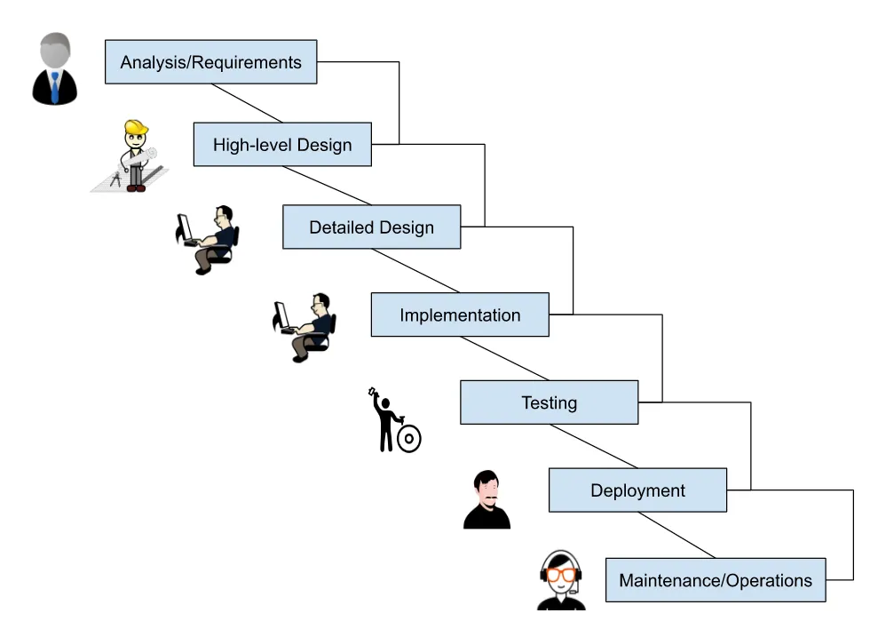
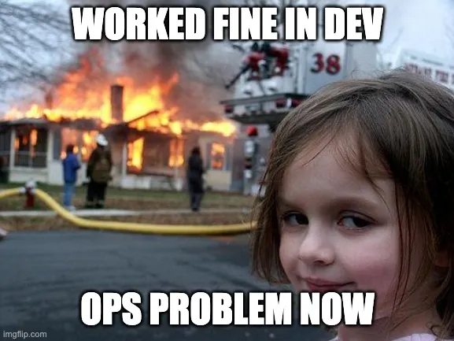
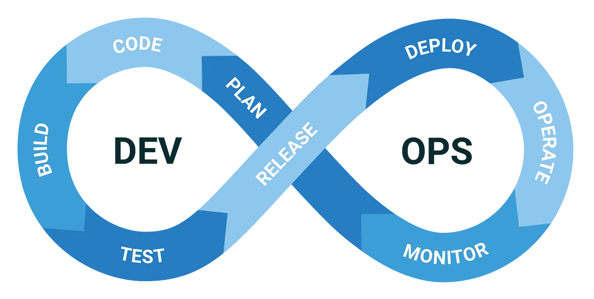
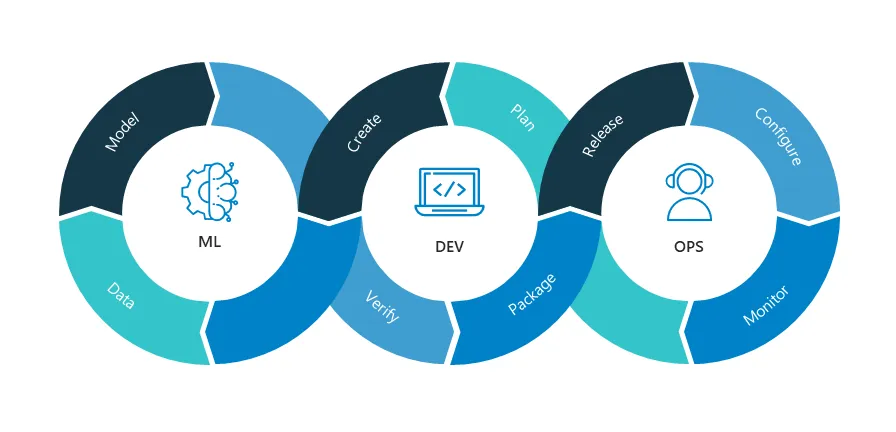
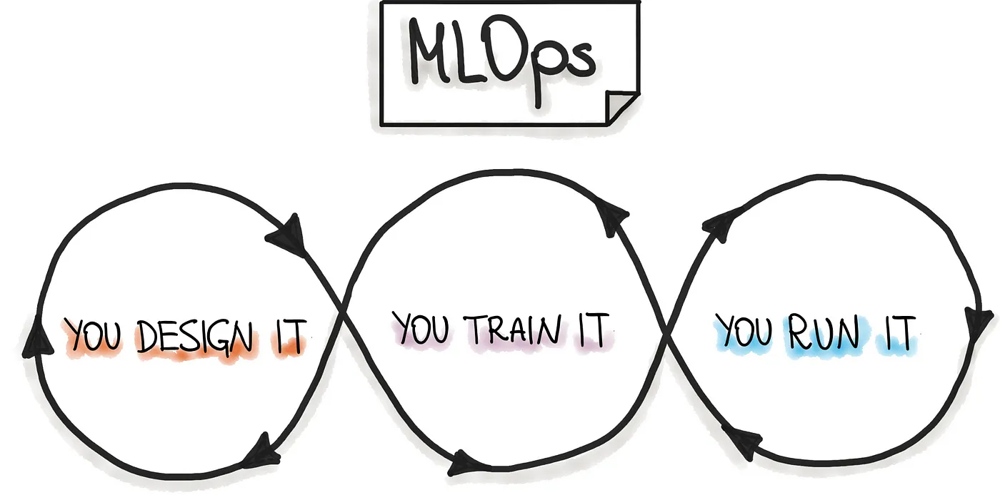

# How MLOps Will Influence the Role of Data Scientists
<figure> 

<figcaption>source: pexels.com</figcaption>
</figure>

## Table of Contents

- [How MLOps Will Influence the Role of Data Scientists](#how-mlops-will-influence-the-role-of-data-scientists)
  - [Table of Contents](#table-of-contents)
  - [Introduction](#introduction)
  - [Brief History](#brief-history)
  - [Life Before MLOps](#life-before-mlops)
  - [The Rise of DevOps](#the-rise-of-devops)
  - [The Emergence of MLOps](#the-emergence-of-mlops)
  - [What are the challenges of practicing MLOps from Data Scientists perspective?](#what-are-the-challenges-of-practicing-mlops-from-data-scientists-perspective)
  - [From Development to Deployment: The Real Journey of Machine Learning Models](#from-development-to-deployment-the-real-journey-of-machine-learning-models)
  - [Critical Focus Areas in MLOps: Enhancing ML Pipelines from Data to Deployment](#critical-focus-areas-in-mlops-enhancing-ml-pipelines-from-data-to-deployment)
  - [Final Thoughts](#final-thoughts)
  - [References](#references)
- [About Me](#about-me)

## Introduction

Over the past few decades, I have witnessed significant shifts in both the functions of software engineers and the practices behind building working software. Today, I am curious as to how the role of data scientists will develop over the course of the next decade. This article will explore how the role will evolve, and this is based solely on my own personal experiences as an engineering leader, architect, and software engineer in the past, as well as my more recent experiences as an aspiring data scientist in the Masters of Data Science (MDS) program at the University of British Columbia. I hope that readers will find this article both informative and interesting.

**Note**: For consistency, this article will refer to "machine learning" (ML); however, the concepts discussed here apply to both the fields of artificial intelligence and data science.

## Brief History

Over the past 20 years, I’ve had the chance to work with a wide range of software and hardware technologies, including network management, enterprise messaging systems, networking device firmware, and most recently SaaS (software as a service) in hybrid and public clouds. One set of questions persisted in every job and product I built over the years, despite changes in the target market, software usage, and the types of solutions I built:

* **How can we rapidly develop applications and services while maintaining high quality, a predictable deployment cadence, and repeatable processes?**

* **What cultural norms, practices, and resources are necessary for this to happen?**

These questions led to the introduction and adoption of [DevOps](https://devops.com/), which first emerged in 2007 when a frustrated project manager, [Patrick Debois](https://www.jedi.be/), got fed up with the separation between software development and IT operations. DevOps is now the de facto standard.

Despite the emergence of new applications and services due to machine learning, the fundamental questions remain unanswered. The machine learning community has embraced MLOps as the emerging gold standard for the construction and delivery of ML-based solutions, building on the successes of DevOps.

## Life Before MLOps
I have seen numerous software and product delivery practices assume various forms and names, from [Rapid Application Development](https://en.wikipedia.org/wiki/Rapid_application_development) (1990–2010), to [Agile and Extreme Programming](https://en.wikipedia.org/wiki/Agile_software_development) (1997-present) and finally, DevOps (2008-present) which evolved from Agile and the growth of Software As A Service([SaaS](https://en.wikipedia.org/wiki/Software_as_a_service)).

Prior to DevOps and Agile, software development followed the waterfall model, starting from analysis/requirements → high-level design → detailed design → implementation → testing → deployment → operations/maintenance

<figure> 

<figcaption>Copyright - Tony Zoght</figcaption>
</figure>

This approach delivered working code for many decades. For example, each of these phases included "specialists" and "departments" to ensure the successful transition to the next state.

* Architects were responsible for translating the requirements into high-level designs and handing them off to software engineers to work on detailed-design and implementation.

* In turn software developers would hand the “working code” to test engineers, who specialized in testing the software but were not responsible for deploying or operating it. Another team on the customer side was responsible for that task.

Going forward from one phase to the next was clearly defined and understood; going back two or more steps, on the other hand, was not well defined and presented a challenge.

For example, if you, as a test engineer, discovered that the software was not meeting a customer requirement, it was a challenging task to provide feedback and revisit the requirements to the architects or product management, who had initially defined them. Change management was more complicated and involved dedicated specialists and a "department." The entirety of the process operated under the presumption that the input for each phase was perfect, and “specialists” at each phase specialized even further.

* **The customers had to wait for new versions and updates of the software for years in many cases.**

* **Production code initial quality was sub-standard, as time to fix issues took long time.**

<figure> 

<figcaption>source: imgflip.com </figcaption>
</figure>

## The Rise of DevOps
When customer demand shifted from enterprise software running on premises and personal computers to cloud services and mobile, the ability to release frequently in order to respond to customer needs became essential.

At the same time, the culture of DevOps emerged as a result of the availability of new paradigms such as virtualization and infrastructure as a service. This coincided with the rise of the cloud computing industry. As a result, fewer “specialists” were required, and the distinctions that had previously existed between the various “departments” became less distinct. The need for “specialists” diminished, and the lines between the different “departments” became blurred.

<figure> 

<figcaption>source: https://octopus.com/devops/ </figcaption>
</figure>

> Practitioners of the DevOps methodology hold the belief that the development and operations teams should no longer be compartmentalized into two distinct silos.

Developers no longer build the software, test it, and then hand it over to operations for them to run and monitor the service they built on top of it. This is the significant shift in culture that drove the development of mature practices, tools, and infrastructure for DevOps.

Test engineers no longer independently tested systems that adopted DevOps at a later stage of the development process, nor did they design them in the ivory towers of the software architects or the CTO's office. All members of the development team collaboratively tested these systems instead.

We developed them from the ground up with the goal of making them simple to deploy, monitor, debug, update, and operate. Developers, who also operate the service, naturally support these software components as fundamental disciplines. Guess what will happen if it crashes while there are not enough logging or monitoring points in the system? The entire team is motivated to update the software so that they can not only fix the issue, but also have the appropriate logging and observability to be able to troubleshoot similar issues in the future and avoid the pain of not having enough cues to neutralize the issue while it is still occurring in production.

In addition to developing and maintaining their software, software engineers who use DevOps have a comprehensive understanding of how end users interact with their products and how to run those products in production. Specialization in one of the silos that I mentioned earlier (architect, design, test, etc.) is becoming a less viable option for career growth and opportunities to work on awesome teams and products.

## The Emergence of MLOps

MLOps, which stands for “Machine Learning Operations,” was born at the intersection of DevOps, Data Engineering, and ML. Although conceptually comparable to DevOps, MLOps' execution differs from DevOps in two ways:

ML systems, in their very nature, are more experimental than traditional software.
When compared to conventional software, the operational complexity of ML components is significantly higher.
MLOps is a collection of best practices and tools that machine learning teams can use to improve their ability to collaborate effectively with engineering and operations professionals, as well as their ability to communicate with those professionals. When implemented in large-scale production environments, these best practices improve quality, streamline management procedures, and automate a significant portion of machine learning (ML) tasks. MLOps is an implementation of the core principles of DevOps.

<figure> 

<figcaption>source: NealAnalytics </figcaption>
</figure>

Data scientists and software engineers work together to overcome the challenges of moving machine learning models from the development stage into production. In the process of overcoming these challenges, they develop an understanding of each other’s methods of operation, which is beneficial to the overall project.

## What are the challenges of practicing MLOps from Data Scientists perspective?

DevOps and MLOps share many similarities; however, when looking at the set of problems that ML needs to address, some differences become apparent:

* Due to the experimental nature of the work, data scientists are required to make adjustments to a variety of features, including [hyperparameters](https://en.wikipedia.org/wiki/Hyperparameter_(machine_learning)), parameters, and models, while also monitoring and managing both the data and the code base in order to produce reproducible results.

* The difficulty of reproducibility is a direct result of the fact that there are a greater number of variables to account for.
Automated model deployment is difficult because, for example, we cannot simply deploy an offline-trained machine learning model as a prediction service. This presents a challenge. It’s not as simple as rolling out new versions of [microservices](https://microservices.io/) as we currently do in large scale SaaS applications.

* The performance of machine learning models that are already in production may suffer not only as a result of suboptimal coding, but also as a result of continually shifting data profiles. You need to make preparations for the fact that models are more susceptible to deterioration than traditional software systems are. You need to have a feedback loop that is capable of emitting the appropriate signals in the event that operator intervention is necessary, that retraining or fine-tuning is required, or that an entire model change is required.

* The hybrid team required to construct and deploy models in production should not consist solely of software engineers. A team working on a machine learning project typically includes data scientists or ML researchers. These individuals place a strong emphasis on exploratory data analysis, model development, and experimentation. There is a possibility that they are not experienced software engineers capable of developing production-level services, and MLOps must close that gap.

## From Development to Deployment: The Real Journey of Machine Learning Models

In the world of machine learning, building a model is just the beginning. The true challenge lies in integrating that model into a larger software ecosystem where it can deliver real value to customers. This section explores the critical aspects of transitioning from development to production, emphasizing the importance of understanding the full lifecycle of a machine learning model. We'll dive into the nuances of scaling, maintaining, and optimizing models as part of a broader service, highlighting the need for collaboration between data scientists and engineers to ensure the success of the final product.

* **It’s all about the Model**: Models don't exist independently; instead, they integrate into pre-existing software systems. They are not the final product; rather, they are a service that is helpful to the customer. Services that require world interpretation (vision, audio, speech, or NLP), prediction, detection, recommendation, or optimization are examples of the types of services that fall under the purview of machine learning.
* **You can seamlessly transition** from dev/lab to prod. The scale of production environments is significantly different from that of development environments and lab setups. This is because system bottlenecks will not be visible to developers while they are working in a lab environment.
* **When your model is successfully deployed, your job is finished**. Comparably, the completion of a software engineer's work coincides with the successful compilation and successful testing of the application. In fact, they have just started their journey, because the majority of a software engineer’s time is spent maintaining existing programs rather than creating new ones.
**We only care about one metric, and that's accuracy**. Well, accuracy is only a factor when selecting and training a model; however, the ML model does not exist in isolation; the end product is a service, and there are far too many other metrics to count that are more important than accuracy, such as service quality, availability, and latency, etc…
* **It’s all about engineering, you don’t need to understand the model**. To gain a deeper understanding of the model and the various touch points that require careful operation and monitoring, data scientists should not only educate themselves but also their fellow agile team members in this particular area.

## Critical Focus Areas in MLOps: Enhancing ML Pipelines from Data to Deployment

In the rapidly evolving field of machine learning, ensuring the seamless operation of ML pipelines and effective MLOps practices is essential for success. At the core of every machine learning-based software are three key artifacts: data preparation, the model itself, and the rollout process. This section highlights the top ten areas of active development within MLOps, addressing critical challenges such as making data discoverable and secure, ensuring reproducibility in model engineering, and creating scalable, reliable deployment strategies. By focusing on these areas, organizations can build robust, efficient pipelines that not only deploy models successfully but also maintain and optimize them in production environments.

1. (Data): How to make the data discoverable and accessible securely.
2. (Model): How to make model engineering reproducible.
3. (Data+Model): How to track, record, and compare experiments.
4. (Model): How to serve models in a scalable, reliable, and efficient way.
5. (Model) How to rollout models into production and make the transition from dev to prod smooth.
6. (Data, Model, and Rollout): How to test at every phase of the pipelines.
7. (Model+Rollout) How to monitor the model in production, looking for key signals.
8. (Rollout): How to make the infrastructure elastic and simple to stand up, scale out, scale in, and tear down (Infrastructure as Code).
9. (Data+Model+Rollout) Explain how to version all artifacts, not just the code.
10. (Data, Model, and Rollout): How to achieve fully automated continuous integration and orchestrated delivery.

So, what does this mean for data scientists?
If the role of data scientists is to develop in a manner analogous to that of software engineers as MLOps mature, then the following things must take place in order to support their journey:

* Data scientists will not only be responsible for analyzing the data and building a model that satisfies the requirements (the early phases), but they will also be responsible for deploying and maintaining the model in production, as well as all of the operational aspects, and not just the Exploratory Data Analysis (EDA), feature engineering, and model training.

Silos between the ML and engineering teams are unacceptable. Data scientists are expected to have a strong understanding of not only the “What” and “Why,” but also the “How.” It will become increasingly important for them to also provide answers to the “How” questions. Important questions to ask include: “Why did they choose this model?” and “What kind of data do they need to train the model on?”. Having the ability to respond to questions such as “How can we make the pipelines reproducible?” and “How can we make it easier to deploy and update?” will become important over time.

* Data scientists must actively participate in defining the ML last mile. The ML last mile is concerned with what happens after the model is deployed and in production. How is it operated? What is its lifecycle? What are the key Performance Indicators? What is the change management process?

<figure> 

<figcaption>source: NealAnalytics </figcaption>
</figure>

## Final Thoughts
Just as the role of software engineers has evolved significantly over the past decade with the advent of DevOps, I believe that the role of data scientists will similarly expand, encompassing a broader range of responsibilities in the future. Embracing MLOps is crucial for data scientists looking to advance their careers, as the field now goes beyond data cleaning, wrangling, and model training. Regardless of how the role continues to evolve, this is an incredibly exciting time to be a data scientist, with machine learning applications solving problems once thought insurmountable. Personally, I am eager to apply the knowledge I've gained from the Masters of Data Science program at the University of British Columbia, as well as my experience in software and service development, to this dynamic field.

## References
* CRISP Paper about model training and lifecycle: https://arxiv.org/pdf/2003.05155.pdf
* Myths of MLOps: https://blog.dataiku.com/the-7-myths-of-mlops
* CIO Magazine, MLOps overcoming ML challenges: https://www.cio.com/article/309160/how-mlops-is-helping-overcome-machine-learnings-biggest-challenges.html
* Waterfall: https://medium.com/@joneswaddell/the-cascading-costs-of-waterfall-5c3b1b8beaec
* Role of Data Scientists: https://www.techtarget.com/searchenterpriseai/definition/data-scientist https://www.mastersindatascience.org/careers/data-scientist/
* MLOps.org: https://ml-ops.org/
* MLOps vs DevOps: Ohttps://devops.com/mlops-vs-devops-whats-the-difference/

# About Me

I have over 20 years of expertise managing software development projects and establishing technical concepts. I am a seasoned professional. Working with a diverse spectrum of organizations—from huge businesses and FAANG to agile startups—I've had the pleasure of scaling teams and delivering creative solutions. I earned my master's degree in machine learning and data science from UBC in 2023, which has stoked my enthusiasm for fusing cloud computing with artificial intelligence to support companies in staying ahead of the curve and realizing the amazing possibilities of technology.
I presently work for a startup in Vancouver as the lead architect, where I am in charge of the technical direction, security and engineering operations. [Quandri](https://www.quandri.io/) increases productivity for brokers, drives improved retention rates, unlocks insights, and automates repetitive operations.
